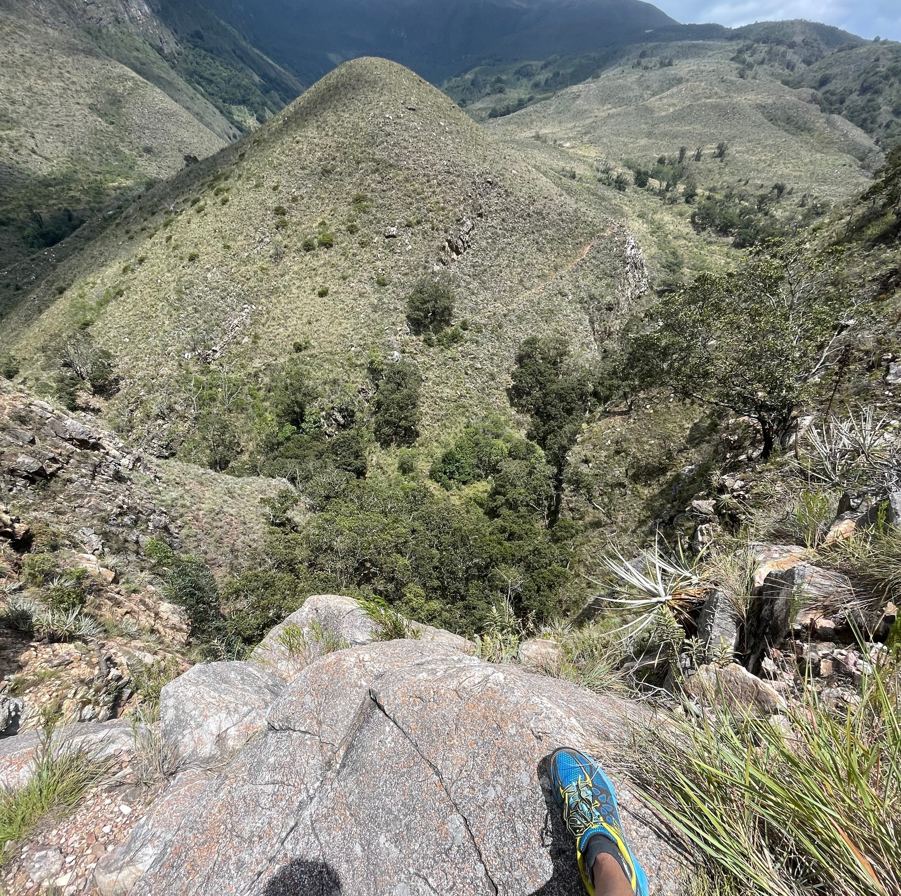

_Villa de Leyva, Boyacá_

A weekly video chat with God  
Will that suffice? – _she asked_  

Your voice isn't yours  
No fair role  
No rebel love  
Within cells shall bursts  

_Within cells interlinked_  
Wasn't him, _Sisyphus in love_?  

Let the maths thrive  
As a rock is never hostile  
You reckon, did _Christ_ ever smile?  
At the glimpse of a seduced eye  

Did the divine came from the sand  
Did the sand from the rocks?  
Not even your sight lurks  
Yet healthy, body unharmed

Human, what's that you lack of?  

A life by the minute  
The soldier's minute  
Live for nothing  
Die for nothing  

Maybe a doctor for the soul will suffice this time  
Apprehend from _Caligula_  

The anguish of existing as such  
Of suffering as such  
But, questions such as  
How much can you suffer?  
_– Always more_  
How much can you rejoice ?  
_– Only an inch_  

You may feel astray  
Derail to indulgence  
Entangle with prudence  
But empty you stay  

_- Again, untouched_

(_Diotima_ joins the videochat)  

Desire wisdom  
Tell me, you seek God because you think God is love?  

I gaze at this world  
Loads of smiles  
Loads of pleasures  
Orderliness and sense of progress  

Christ did die  
So you and God can smile  
But, I am afraid  
Love is not a God at all  
Neither wise nor _beautiful_  

Tenderness of the spirit, that's love!  
Yes, a desire it is  
_The_ center of the world  
A desire for knowledge  
Out of all there _is_  
Out of _all_ that could be  
It is in fact  
A constant video chat with God

 
