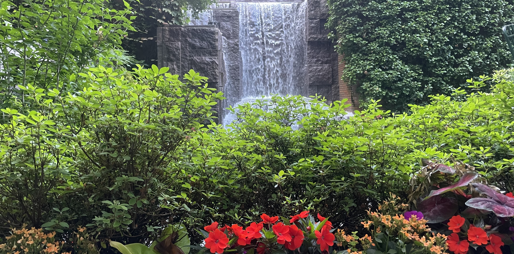

_A calm park, New York_

Pienso en tu amplio mirar,  
incesante, casi _dilettante_.  

El tiempo,  
hasta ahora inmutable, precisa tus reglas para esquivar.  

Vida calculable,  
ausente de novedad.  

El tiempo,  
astuto como es,  
medir _ha_ de olvidar.  

Vacilante, entre dos,  
dos almas,  
dos minutos,  
dos segundos.  
¿Dos tiempos?  

¿Escuchas esta queja?  

Como cascada,  
inevitable y fluvial.  
No quisiera con tus reglas navegar.  

Desvía el tiempo su caudal.  
Estético, atractivo y funcional,  
también con dulce y misteriosa densidad.  

Arquitecto de aromas,  
lo puedo nombrar.  
Quejas no podrá escuchar,  
solo aromas recordar.  

Registrados cuidadosamente,  
en pensamientos y más allá,  
donde el suelo solo sentirás girar.  

Fugitivo e impune,  
de filo amplio,  
cortante de la continuidad.  

¡Justicia he de implorar!,  
¡Por los tiempos ociosos que se me van!  
