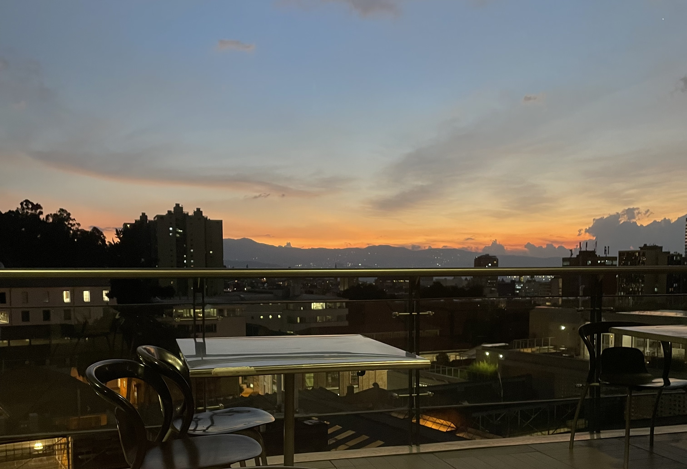

A priori perfumas la cima  
Instauras quehaceres  
Porque de los mediadores eres   
Sublimas rutina casi sonando como ruina  

Como evanescente procedes   
Entre lo intrascendente, urgente y biológico  
Bajando cimas, navegando mares  
Saboreas el infinito  
En un gramo de sal en tus labios  
Un producto de la misma gracia  
Del continuo enredo  
Fractal y equivalente  
De la vida y la muerte  

Del sufrimiento haces arte  
Del descubrimiento progreso   
De los mares perfumes  
y de las las cimas saberes  
Cuentas estrellas pero alcanzas mas placeres  

Piensas en la tumba  
Lo placentero de ser perecedero  
En el absurdo del suicidio  
No encontrando placer ulterior  
Inclusive un ser superior  
Siendo el destino nada más que salino  

Unos labios no tocados  
Besos escritos no entregados  
Vida no gastada  
Bajo noches estrelladas  
En la lentitud de las miradas  
Una totalidad fragmentada  

Infalible lo que ves  
Imposible ver al sol perenne  
Sin la impotente ceguera cósmica    
Posible soñar y desear   
Y es todo un placer   
Uno realmente ulterior   
Proceder, ser y perecer   
En nada más que polvo estelar   