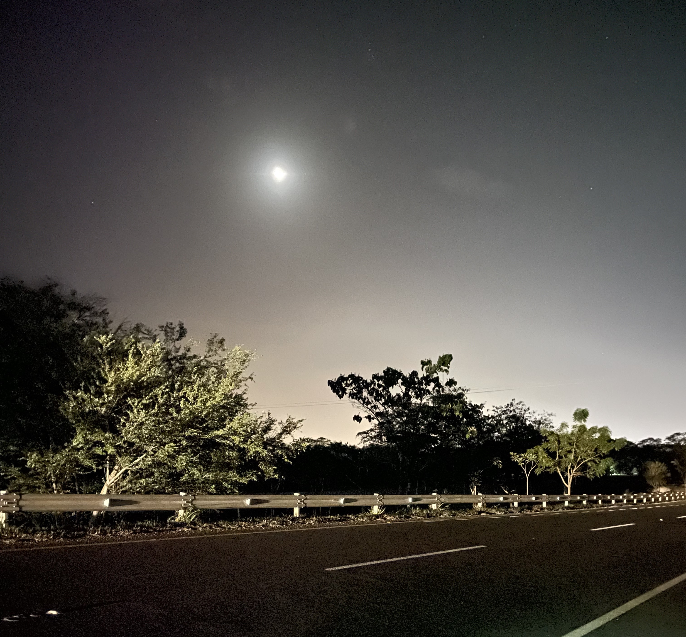

¿Nos esperarán las estrellas?   
Mientras podría soñar   
Soñar despierto   
Seducir al tiempo   
 
O mejor aun   
Ganar el tiempo    
Con etéreo recuerdo   
y sueño casi eterno   
¿Son los sueños recuerdos o deseos?   
¿Seré solo yo y mis circunstancias?   
 
Entre las montañas y el océano    
El sol centella en tus ojos   
Con la luz instaurada en tu mirada    
¡De solo verte bailar!   
Bailar en lo etéreo    
Sin prisa ni pausa como el firmamento   
 
Yo en mi primor a lo efímero   
Mil imágenes, mil caminos   
Un camino que conduce a tus brazos   
Una imagen de tus labios   
Sonríes, tierna como eres   
Las estrellas, ya ajenas    
Pues cesan ellas; mientras tu sonríes    
Mil de esto, mil de aquello   
Cierne todo lo bello   
 
¿Encontraré una galaxia de lo tierno en mil quinientos desvelos?   
Tendría que cartografiar   
Pero sabes que elegiría cantar   
Recitar hasta que el sol no suba ni baje   
Pues feliz el sol estará; en su eterno dormitar   
¿Y las estrellas?    
– Claras y brillantes   
Como la vez desde acá   
¡Imagínate allá!

----