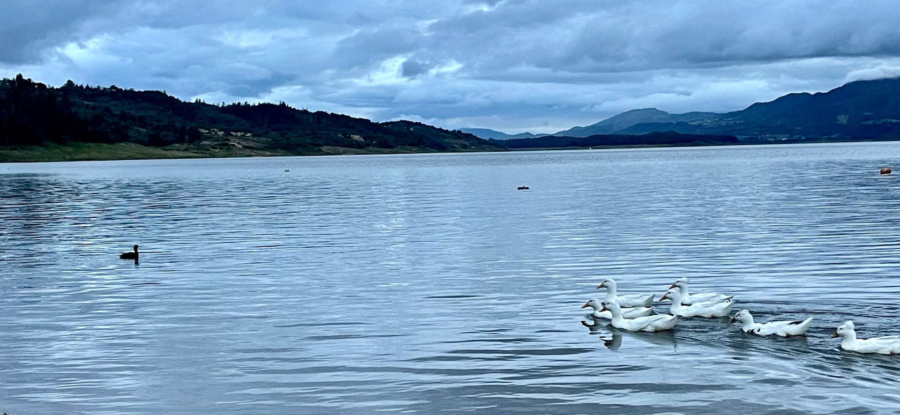

_Cundinamarca, Guatavita_

_Encuentro:_  

Tus ojos,  
La simetria,  
un instante,  
una pausa.  

_Pierdo:_  

Un lugar,  
fuera de alcance,  
libre del tiempo,  
continuo, abundante.  

Pierdo el suelo,  
y lo encuentro.  
Lo vuelvo a perder,  
y lo vuelvo a encontrar  
¿Así te sientes querida rueda?  

De sujeción nula,  
La verdad pura y desnuda.  

Absurda alquimia,  
incompresible probabilidad,  
vago relieve,  
inasequible realidad.  

Solo a través de un cristal,  
Poseo este cuerpo,  
transparente, aislado,  
vertido, asombrado.  

Del _panóptico_, fugitivo,  
siempre alegre de perderse,  
en el mundo de las cosas.  
en las _cosas de los mundos_.  
Material o inmaterial,  
inteligible o sensible.  

He de transitar un puente,  
flotando vaporoso,  
pensando deseoso,  
Insistente o valiente.  

Cuan intrascendente,  
diáfana de luz,  
te canto _modernidad_,  
Transparente, frágil de cristal,  
fría y dura de metal.  

¿Me revocas este deseo?  
Tan intenso placer de vivir  
¿Dónde estás tenuidad?  
¿Con quien estas continuidad?  

Experta en aplazamiento,  
¡Olvida ya la cantidad !  
¡Lo infinito – es _cualidad_ !  

Ven, te entrego este cantar,  
_tócalo_: es palpable,  
como el tiempo: consonante,  
como un _armoa_: fulgurante.  

Lo perderás,  
lo encontrarás,  
lo tienes,  
tenlo un poco más,  
ten, toma mis labios,  
besa sin perder,  
mira sin encontrar.  

Recuerda, _es la vida un carnaval_.  
